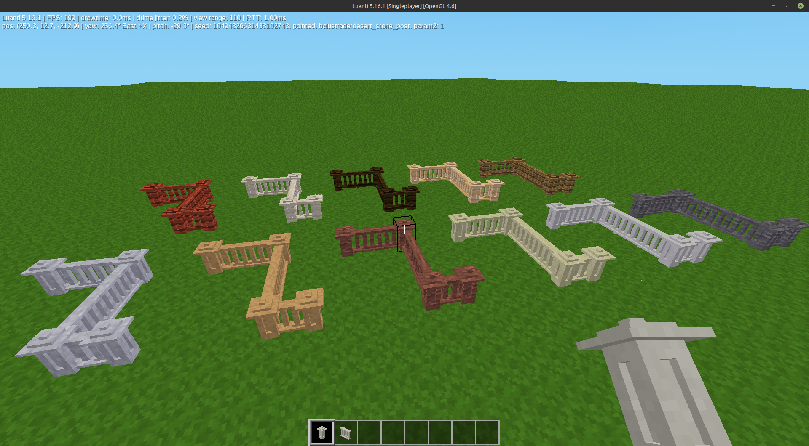
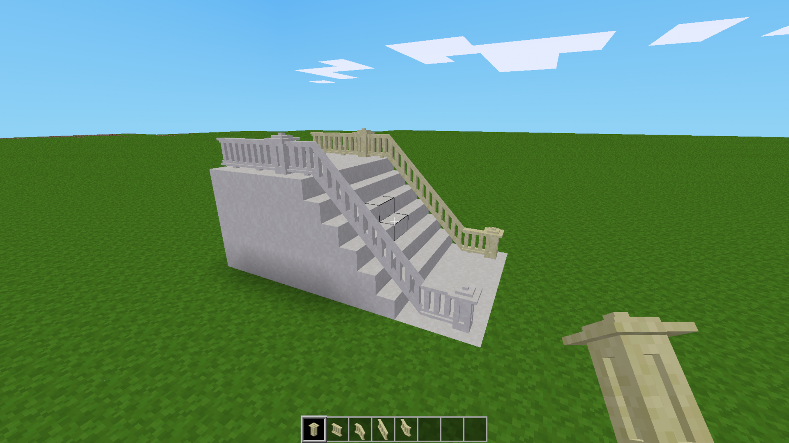
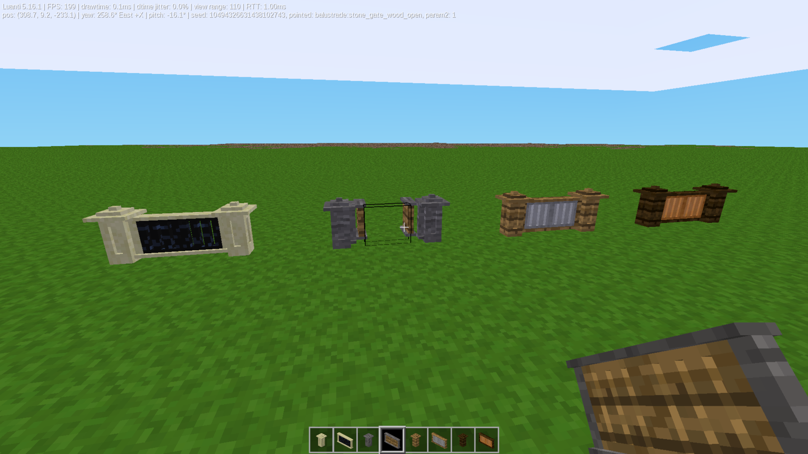
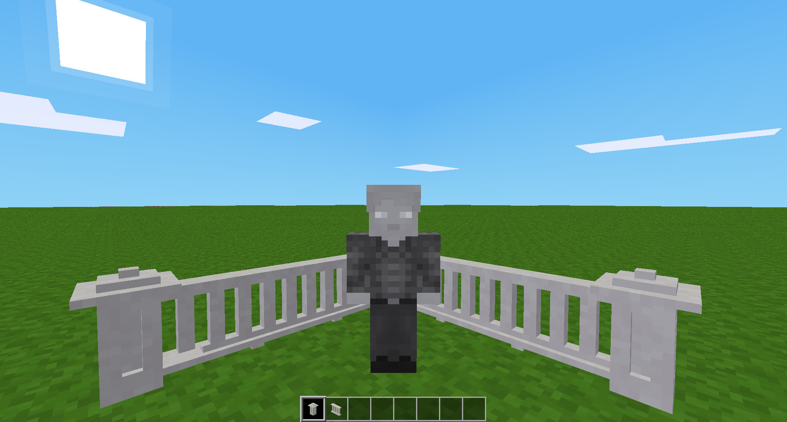

# Balustrade

This mod adds nice looking, decorative balustrades to your world. You can use them to decorate your  rooftops, balconies, porches, and walkways!

## Features
* **The Materials:** All of the base stone types, clay, and all of the wood types.
* **Auto-Connecting:** The posts operate like fences using the nodebox type = connected.
* **Beautiful 3D Previews:** Items use the 3D option for Inventory & Weild Items.
* **What You Get:** - Balustrade Post (the "fence-like" connecting node.
					- Baluster (the straight-line railing).
					- Upper & Lower Balusters (logic should kick in here).
					- And the Stair Balusters (to fill in the gaps between the Upper & Lower nodes).
					- Balustrade Gates: Double gates which are completely modular (you can choose the materials for the railings, & the spindles, changable in the code / init.lua file)

## How to Get Items
You can find all the posts, balusters & gates inside your Creative Mode inventory.

If you are playing in Survival Mode, you can make them using standard crafting recipes with your choice of wood, stone, or metal materials, ..or add materials from your favorite mods.

